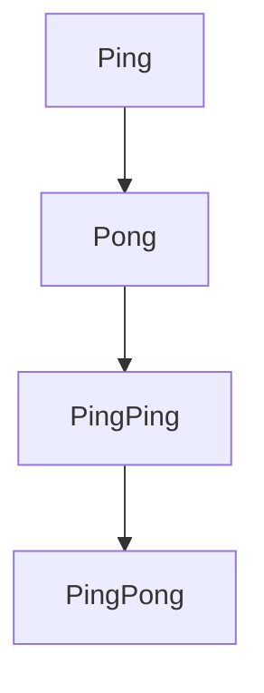

# An example h1 tag! 

_some underlined preamble regarding the Artists' way_

## A h2 tag, with a slightly brighter colour scheme 

When Alice falls down the rabbit hole, she finds herself in Wonderland where she embarks upon the most bizarre adventure, encountering many outlandish creatures as she goes. 

### Most AI in production today is just request routing

Crazy. Everyone outsources compute these days.

#### Images
Images are now rendered in a centred way, by default

##### JS standards


#### Blockquotes in dark mode

Block-quoted text, in dark mode, is now legible (as it is brighter)
> An example of some block-quoted text here. Try flicking back and forth to dark-mode.

#### Similar with footnotes 

A footnoted blockquote, to follow:

> "We are not accustomed to measuring our everyday encounters in milliseconds, but studies have shown that most of us will reliably report perceptible “lag” once a delay of over 100–200 milliseconds is introduced into the system. Once the 300 millisecond delay threshold is exceeded, the interaction is often reported as “sluggish,” and at the 1,000 milliseconds (1 second) barrier, many users have already performed a mental context switch while waiting for the response—anything from a daydream to thinking about the next urgent task.

-- Ilya Grigorik, High Performance Browser Networking [^1].

#### Mermaid charts "just work" out of the box.

They also automatically become placed on a white background if you toggle to dark mode, try it!

##### Ping Pong pipeline example 


##### An even more involved example 

```mermaid
%%{init: {'theme': 'forest', 'fontSize': 48, 'barHeight': 36, 'taskTextRight': 'always', 'titleTopMargin': 50,  "flowchart" : { "curve" : "basis" }} }%%
gantt
    dateFormat  s 
    axisFormat  %S.%Ls
    title       Latency Comparison
    excludes    weekends
    %% (`excludes` accepts specific dates in YYYY-MM-DD format, days of the week ("sunday") or "weekends", but not the word "weekdays".)

    section Slow 
    Post to slow service           :crit, a1, 0, 0.4s
    Slow operation                :a2, after a1, 0.1s
    Receive from slow service       :crit, a3, after a2, 0.4s
    Post to other slow service            :crit, a4, after a3, 0.4s
    Other slow operation            :a5, after a4, 0.1s
    Receive from other slow service            :crit, a6, after a5, 0.4s
    Finish    :a7, after a6, 0.1s
    
    section Fast 
    Post to Fast service           :crit, b1, 0, 0.4s
    Fast operation                :b2, after b1, 0.1s
    Receive from fast operation            :b3, after b2, 0.1s
    Finish    :b4, after b3, 0.1s
```


#### Code snippets also auto-toggle between light and dark mode thanks to the two css files

```js
const queryPipeline: OneContext.PipelineCreateType = \
OneContext.PipelineCreateSchema.parse({
  API_KEY: API_KEY,
  pipelineName: queryPipelineName,
  pipelineYaml: "./query.yaml",
})
await OneContext.createPipeline(queryPipeline);
```

### Embed iframes directly on the page! 

This is great if you host content / vlog / want to reference other videos in your prose.

<comp.YouTube id={`aaSl7ZU3ppM`}/>

[^1]: High Performance Browser Networking, Ilya Grigorik. Buy it [here](https://www.amazon.co.uk/High-Performance-Browser-Networking-performance/dp/1449344763).
